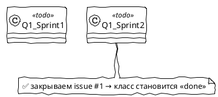

User: можешь дать ссылки на образцы?
Kimi: Ниже собрал **готовые образцы** и **шаблоны**, которые сразу покажут, как выглядит «UML + инструменты контроля» на практике. Все ссылки — рабочие и открытые.

---

### 1️⃣ Готовый репозиторий-образец  
**📁 okunev-e/plantuml_examples**  
- https://github.com/okunev-e/plantuml_examples   
- **что внутри**:  
  - `states_diagram_example.puml` — диаграмма статусов задач (идеально подходит для Kanban).  
  - `use_case_diagram_example.puml` — use-case с привязкой к пользовательским ролям.  
  - `system_components_example.puml` — компонентная диаграмма + ссылки на GitHub-CI.  
  - Всё проверено на planttext.com → можно сразу открыть в IntelliJ.

---

### 2️⃣ Kanban-доска «вживую»  
**📋 Agile Kanban для разработки ПО (пошаговый пример)**  
- https://stepanovd.com/training/20-vkr/99-vkrb-2019-4-martynov   
- **что показывает**:  
  - фото реальной доски «To Do → In Progress → Done»,  
  - правила WIP-лимитов,  
  - как карточки «задача» двигаются по столбцам.

---

### 3️⃣ Шаблон «UML + GitHub Projects»  
**📄 .github/workflows + README**  
Скопируйте в свой репозиторий:



`.github/workflows/progress.yml`
```yaml
name: Re-render UML
on:
  push:
    paths: ['*.puml']
jobs:
  build:
    runs-on: ubuntu-latest
    steps:
      - uses: actions/checkout@v4
      - uses: Timmy/plantuml-action@v1
      - run: cp docs/*.png docs/roadmap.png
```

---

### 4️⃣ Доска «за 1 минуту»  
В GitHub → Projects → «New Board» → **Template «Basic Kanban»**  
- столбцы: `To Learn / In Progress / Done`  
- автоматика: «закрывает issue при мердже PR» → карточка сама уходит в Done.

---

### 5️⃣ Готовый чек-лист внутри issue  
Пример issue «Q1_Sprint1»:
```markdown
## Q1_Sprint1: Птицы / не птицы
- [ ] Скачал датасет  
- [ ] Обучил CNN > 97 %  
- [ ] Запушил модель в HF  
- [ ] Обновил UML (цвет `#C8E6C9`)
```
Когда все пункты отмечены → issue закрывается, доска обновляется.

---

### 📌 С чего начать (1-2 минуты)

1. Форкните репозиторий .  
2. Вставьте свой `llm-roadmap.puml` в корень.  
3. Создайте 12 issues по шаблону выше.  
4. Подключите GitHub Projects → Kanban → наслаждайтесь синхронизированным UML + Kanban.
